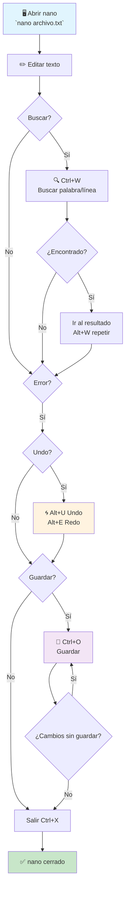

# Chuleta rápida de atajos de GNU nano
> ...Cuando estás sólo ante el peligro

### by RS Montalvo

Nano es el editor que nunca falta. No presume ni brilla, pero siempre está ahí, incluso cuando todo lo demás falla.  
Si te encuentras frente a un servidor remoto o un sistema en emergencia y tu única arma es `nano`, esta chuleta te servirá de mapa para salir con elegancia del tiroteo.

## Navegación básica

| Acción                              | Atajo                         |
| ----------------------------------- | ----------------------------- |
| Inicio de línea                     | Ctrl + A                      |
| Final de línea                      | Ctrl + E                      |
| Subir una línea                     | Ctrl + P                      |
| Bajar una línea                     | Ctrl + N                      |
| Avanzar un carácter                 | Ctrl + F                      |
| Retroceder un carácter              | Ctrl + B                      |
| Palabra anterior                    | Ctrl + ←                      |
| Palabra siguiente                   | Ctrl + →                      |
| Desplazar vista hacia arriba        | Ctrl + ↑                      |
| Desplazar vista hacia abajo         | Ctrl + ↓                      |

## Movimiento por páginas y saltos

| Acción                              | Atajo                         |
| ----------------------------------- | ----------------------------- |
| Página siguiente                    | Ctrl + V                      |
| Página anterior                     | Ctrl + Y                      |
| Ir a línea/columna                 | Ctrl + _ (guion bajo)        |
| Ir al final del archivo             | Alt + /                       |
| Inicio del documento                | Ctrl + Home                   |
| Final del documento                 | Ctrl + End                    |

## Búsqueda y reemplazo

| Acción                              | Atajo                         |
| ----------------------------------- | ----------------------------- |
| Buscar texto                        | Ctrl + W                      |
| Repetir búsqueda                    | Alt + W                       |
| Buscar y reemplazar                 | Ctrl + \\                     |
| Ayuda de regex (en búsqueda)        | Ctrl + T                      |

## Selección, cortar, copiar y pegar

| Acción                              | Atajo                         |
| ----------------------------------- | ----------------------------- |
| Marcar inicio de selección          | Ctrl + ^                      |
| Cortar selección / línea actual     | Ctrl + K                      |
| Pegar                               | Ctrl + U                      |
| Copiar sin cortar                   | Alt + 6                       |
| Cortar hasta el final del archivo   | Alt + T                       |

## Edición e indentación

| Acción                              | Atajo                         |
| ----------------------------------- | ----------------------------- |
| Indentar bloque                     | Alt + }                       |
| Desindentar bloque                  | Alt + {                       |
| Comentar / descomentar líneas       | Alt + 3                       |
| Borrar palabra siguiente            | Alt + D                       |
| Borrar carácter bajo el cursor      | Ctrl + D                      |
| Retroceso (borrar anterior)         | Ctrl + H                      |

## Deshacer y rehacer

| Acción                              | Atajo                         |
| ----------------------------------- | ----------------------------- |
| Deshacer                            | Alt + U                       |
| Rehacer                             | Alt + E                       |

## Utilidades y “quality of life”

| Acción                              | Atajo                         |
| ----------------------------------- | ----------------------------- |
| Mostrar ayuda                       | Ctrl + G                      |
| Mostrar posición del cursor         | Alt + P                       |
| Alternar posición en barra de estado| Alt + C                       |
| Alternar numeración de líneas       | Alt + N                       |
| Info del documento (líneas, palabras)| Ctrl + C                     |
| Insertar otro archivo               | Ctrl + R                      |

## Guardar y salir

| Acción                              | Atajo                         |
| ----------------------------------- | ----------------------------- |
| Guardar archivo                     | Ctrl + O                      |
| Salir de nano                       | Ctrl + X                      |
| Corrector ortográfico (si disponible)| Ctrl + T                     |

---

### Nota sobre la tecla Meta (Alt)

En nano, los atajos con **Meta** se muestran como `M-` y normalmente corresponden a **Alt**. [web:2]  
Si Alt no funciona en tu terminal, puedes usar **Esc** y luego la tecla (por ejemplo, `Esc` seguido de `U` para deshacer). [web:2]



```text
1. nano miarchivo.txt          # Abrir
2. Ctrl+A/E/P/N/F/B            # Navegar
3. Ctrl+W                      # Buscar "funciónX" 
4. Alt+W                       # Repetir búsqueda
5. Ctrl+K/U                    # Cortar/pegar si hace falta
6. Alt+U                       # Undo si metes la pata
7. Ctrl+O                      # Guardar
8. Ctrl+X                      # Salir limpio
```
