# Emacs, WSL2 y Windows 11: Construyendo el Entorno de Desarrollo Definitivo
## by RS Montalvo

Muchos desarrolladores huyen de la terminal en WSL porque se sienten "atrapados" en un silo: el portapapeles no funciona, no pueden abrir sus herramientas de Windows desde Linux y la configuración de los editores modernos (como Doom Emacs) suele ser demasiado rígida.

Tras una intensa sesión de configuración, hemos logrado romper esas barreras. Aquí está la hoja de ruta para una integración del 99.9%.

## 1. El Puente: Arquitectura de Integración

Para entender por qué este entorno es superior, hay que visualizar cómo interactúan ambos mundos:


<center></center>

* **(A) Interop:** Emacs en WSL lanza procesos `.exe` de Windows de forma nativa.
* **(B) Shared Resources:** El portapapeles de Windows es ahora el portapapeles de Emacs.

---

## 2. Los "Game Changers" de la Configuración

### El Clipboard Infalible

Olvídate de configurar servidores X o protocolos complejos. Usamos el puente nativo de Windows:

```elisp
(defun wsl-copy (text)
  (let ((proc (start-process "clip.exe" nil "clip.exe")))
    (process-send-string proc text)
    (process-send-eof proc)))

(setq interprogram-cut-function 'wsl-copy)

```

### El Alias de Notepad++ (desde Eshell)

¿Necesitas ver un archivo en un editor externo desde tu terminal de Linux?
`("npp" "\"/mnt/c/Program Files/Notepad++/notepad++.exe\" $1")`
*Clave: Escapar las comillas para manejar los espacios en "Program Files".*

### Salto de precisión con Avy (M-z)

En terminales WSL, el atajo `C-;` suele fallar. Re-mapear Avy a `M-z` (sustituyendo el poco usado *zap-to-char*) devuelve la velocidad de navegación "Ace-Jump" al entorno de consola.

---

## 3. Lecciones Aprendidas (The Hard Way)

1. **UTF-8 o muerte:** Windows y Linux manejan finales de línea distintos (`\r\n` vs `\n`). Forzar `utf-8-unix` en Emacs evita que el editor te pregunte la codificación cada vez que guardas un archivo copiado de Windows.
2. **La Terquedad de Smartparens:** En Doom Emacs, Smartparens es el "rey" por defecto. Si prefieres la lógica estructural de **Paredit**, no basta con un hook simple; a veces hay que usar un `timer` o el macro `after!` para asegurar que Paredit gane la prioridad en el buffer de *scratch*.
3. **Emacs-nox:** Si vas a trabajar 100% en terminal de Windows, instala la versión `nox`. Es más ligera, no busca pantallas inexistentes y funciona "out of the box".

---

## Conclusión: ¿Por qué este setup?

Hemos combinado la robustez de **Ubuntu 24.04** con la comodidad de la interfaz de **Windows 11**. El resultado es un "caballo de carreras": una terminal que no se siente como una cárcel, sino como un centro de mando con acceso total a ambos sistemas operativos.

