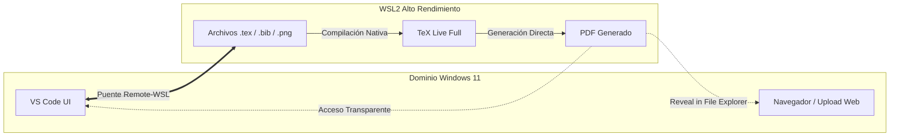

# LaTeX en Windows 11: Por qué deberías jubilar a MiKTeX y abrazar TeX Live en WSL2

## by RS Montalvo

**Introducción**

Si eres de los que todavía usa MiKTeX en Windows mientras el resto de tu código vive en WSL2, estás pagando un "impuesto de rendimiento" invisible. Compilar LaTeX suele ser una tarea intensiva en lectura de archivos: cientos de paquetes `.sty`, imágenes y archivos auxiliares se procesan en cada pasada.

¿El secreto para que la compilación sea instantánea? **Mantener el motor en el mismo sitio que el combustible.**

---

## La Comparativa: ¿Dónde debe vivir tu compilador?

Para muchos colegas, la duda es: *"¿Si instalo LaTeX en WSL, mis PDF quedarán atrapados en Linux?"*. La respuesta corta es no, y las ventajas superan con creces ese pequeño matiz.

| Característica | LaTeX en Windows (MiKTeX) | LaTeX en WSL (TeX Live) |
| --- | --- | --- |
| **Velocidad de compilación** | **Lenta.** Cada archivo leído viaja por el puente de red interno. | **Ultra-rápida.** Acceso nativo al sistema de archivos Ext4. |
| **Gestión de paquetes** | Manual / Interfaz gráfica que a veces falla en entornos híbridos. | **Automatizada y profesional.** Uso de `tlmgr` o `apt`. |
| **Integración con Git** | **Riesgosa.** Problemas de finales de línea (CRLF) y permisos. | **Total.** Tus archivos `.tex` y tu Git están en el mismo dominio. |
| **Acceso al PDF** | Directo en tu carpeta de Windows. | **Transparente.** Vía `\\wsl$` o el visor interno de VS Code. |

---

## El Esquema del Flujo "Smart"

El siguiente esquema muestra cómo hemos configurado el entorno para que sea un sistema de **alto rendimiento**. VS Code actúa como la "ventana" a un motor que corre a plena potencia dentro de Linux.



---

## Derribando el mito: "Mis archivos PDF están escondidos"

Este es el punto que más preocupa a los colegas. Si generas un PDF en WSL, ¿cómo lo subes a la plataforma de la universidad o lo envías por correo? Tienes tres llaves maestras:

1. **El visor de VS Code:** La extensión *LaTeX Workshop* abre el PDF en una pestaña del editor. No necesitas visores externos.
2. **El atajo del Explorador:** Si haces clic derecho sobre el PDF en la barra lateral de VS Code y eliges **"Reveal in File Explorer"**, Windows abrirá una ventana directamente en la carpeta de Linux.
3. **La terminal mágica:** Escribe `explorer.exe .` en tu terminal de WSL y la carpeta de tu proyecto se abrirá en Windows al instante.

---

## Guía de Instalación Rápida

Para los que quieran replicar este setup hoy mismo:

1. **En WSL (Ubuntu):** Instala el motor completo para evitar errores de paquetes faltantes:
```bash
sudo apt update && sudo apt install texlive-full

```


2. **En VS Code (Windows):** Instala la extensión **LaTeX Workshop**. Asegúrate de que se instale en el dominio **"WSL: Ubuntu"**.
3. **Configuración de Autoguardado:** Ve a los ajustes de la extensión y activa `latex-workshop.latex.autoBuild.run`. Ahora, cada vez que pulses `Ctrl+S`, el PDF se actualizará en menos de lo que parpadeas.

---

## Conclusión: Menos fricción, más ciencia

Al mover LaTeX a WSL, no solo ganas velocidad; ganas **consistencia**. Tu entorno de trabajo es ahora idéntico al de un servidor de integración continua o al de un colega que use Linux puro. Has eliminado el puente de red como cuello de botella y has unificado tu flujo de Git.

**¿El resultado?** Te olvidas de la herramienta y te concentras en lo que escribes. ¡Eso es ser realmente *smart*!

